# Rancang Bangun Sistem Informasi Manajemen UKM (LMS & Administrasi)
Dokumen ini menyajikan rancangan **Entity Relationship Diagram (ERD)** dan **Use Case Diagram** berdasarkan analisis database, model Eloquent, routing, dan kontroler pada codebase sistem saat ini.

---

## 1. Entity Relationship Diagram (ERD)

Sistem ini memiliki total 16 entitas utama dengan tabel perantara (*pivot tables*) untuk menangani hubungan *many-to-many* antara kegiatan, anggota, dan pelatih. Di bawah ini adalah visualisasi ERD menggunakan sintaks Mermaid.

```mermaid
erDiagram
    %% --- ENTITIES ---

    USER {
        bigint id PK
        string name
        string email
        string password
        string role "super_admin | admin_biro | ukm_admin | user"
        string npm "nullable"
        string faculty "nullable"
        string major "nullable"
        string phone "nullable"
        string photo "nullable"
        timestamp email_verified_at "nullable"
        timestamp created_at
        timestamp updated_at
    }

    UKM {
        bigint id PK
        string name
        text description "nullable"
        string logo "nullable"
        string phone "nullable"
        text vision "nullable"
        text mission "nullable"
        string structure_image "nullable"
        boolean is_recruitment_open
        timestamp created_at
        timestamp updated_at
    }

    UKM_CLASSIFICATION {
        bigint id PK
        bigint ukm_id FK "ukms"
        string name "e.g., Departemen/Divisi/Sopran/Alto"
        timestamp created_at
        timestamp updated_at
    }

    MEMBERSHIP {
        bigint id PK
        bigint user_id FK "users"
        bigint ukm_id FK "ukms"
        bigint ukm_classification_id FK "ukm_classifications, nullable"
        string role_in_ukm "admin | member"
        string status "pending | approved | rejected"
        timestamp created_at
        timestamp updated_at
    }

    EVENT {
        bigint id PK
        bigint ukm_id FK "ukms"
        bigint created_by FK "users"
        string title
        text description "nullable"
        string location "nullable"
        datetime start_date
        datetime end_date "nullable"
        string status "upcoming | ongoing | completed"
        timestamp created_at
        timestamp updated_at
    }

    ACTIVITY_SESSION {
        bigint id PK
        bigint event_id FK "events"
        string title
        date date
        text description "nullable"
        boolean is_open "true if member can check-in"
        timestamp created_at
        timestamp updated_at
    }

    ATTENDANCE {
        bigint id PK
        bigint event_id FK "events"
        bigint session_id FK "activity_sessions"
        bigint user_id FK "users"
        string status "hadir | sakit | izin | alpa"
        timestamp created_at
        timestamp updated_at
    }

    COACH {
        bigint id PK
        bigint ukm_id FK "ukms"
        string name
        string category "nullable"
        string photo "nullable"
        text description "nullable"
        text skills "nullable"
        timestamp created_at
        timestamp updated_at
    }

    COACH_ATTENDANCE {
        bigint id PK
        bigint event_id FK "events"
        bigint session_id FK "activity_sessions"
        bigint coach_id FK "coaches"
        string category "nullable"
        string name
        text notes "nullable"
        string status
        timestamp created_at
        timestamp updated_at
    }

    ANNOUNCEMENT {
        bigint id PK
        bigint ukm_id FK "ukms"
        bigint event_id FK "events, nullable"
        bigint created_by FK "users"
        string title
        text content
        timestamp created_at
        timestamp updated_at
    }

    FINANCE {
        bigint id PK
        bigint ukm_id FK "ukms"
        bigint created_by FK "users"
        string title
        string type "income | expense"
        decimal amount
        text description "nullable"
        date transaction_date
        bigint event_id FK "events, nullable"
        timestamp created_at
        timestamp updated_at
    }

    INVENTORY {
        bigint id PK
        bigint ukm_id FK "ukms"
        bigint created_by FK "users"
        string name
        integer quantity
        string condition "good | damaged | lost"
        string location "nullable"
        text description "nullable"
        bigint event_id FK "events, nullable"
        timestamp created_at
        timestamp updated_at
    }

    MATERIAL {
        bigint id PK
        bigint ukm_id FK "ukms"
        bigint created_by FK "users"
        string title
        string type "nullable"
        string file_path
        text description "nullable"
        bigint event_id FK "events, nullable"
        timestamp created_at
        timestamp updated_at
    }

    GALLERY {
        bigint id PK
        bigint ukm_id FK "ukms"
        bigint created_by FK "users"
        string title
        string type "nullable"
        string file_path
        timestamp created_at
        timestamp updated_at
    }

    SUBMISSION {
        bigint id PK
        bigint ukm_id FK "ukms"
        bigint user_id FK "users"
        bigint category_id FK "submission_categories"
        string type "nullable"
        string title
        text description "nullable"
        string attachment "nullable"
        string status "pending | approved | rejected"
        text notes "nullable"
        bigint event_id FK "events, nullable"
        timestamp created_at
        timestamp updated_at
    }

    SUBMISSION_CATEGORY {
        bigint id PK
        string name
        text description "nullable"
        timestamp created_at
        timestamp updated_at
    }

    %% --- PIVOT TABLES ---

    EVENT_PARTICIPANTS {
        bigint event_id FK "events"
        bigint membership_id FK "memberships"
        timestamp created_at
        timestamp updated_at
    }

    EVENT_COACH {
        bigint event_id FK "events"
        bigint coach_id FK "coaches"
    }

    %% --- RELATIONSHIPS ---

    USER ||--o{ MEMBERSHIP : "memiliki"
    UKM ||--o{ MEMBERSHIP : "memiliki"
    UKM ||--o{ UKM_CLASSIFICATION : "mendefinisikan"
    UKM_CLASSIFICATION ||--o{ MEMBERSHIP : "mengklasifikasikan"
    UKM ||--o{ EVENT : "menyelenggarakan"
    USER ||--o{ EVENT : "membuat"
    EVENT ||--o{ ACTIVITY_SESSION : "memiliki"
    ACTIVITY_SESSION ||--o{ ATTENDANCE : "mencatat"
    USER ||--o{ ATTENDANCE : "melakukan_absensi"
    EVENT ||--o{ ATTENDANCE : "merekap"
    UKM ||--o{ COACH : "memiliki"
    COACH ||--o{ COACH_ATTENDANCE : "mencatat"
    ACTIVITY_SESSION ||--o{ COACH_ATTENDANCE : "mencatat"
    EVENT ||--o{ COACH_ATTENDANCE : "merekap"
    UKM ||--o{ ANNOUNCEMENT : "mempublikasikan"
    EVENT ||--o{ ANNOUNCEMENT : "dikaitkan_dengan"
    USER ||--o{ ANNOUNCEMENT : "membuat"
    UKM ||--o{ FINANCE : "mencatat_keuangan"
    USER ||--o{ FINANCE : "menginput_keuangan"
    EVENT ||--o{ FINANCE : "dikaitkan_dengan"
    UKM ||--o{ INVENTORY : "memiliki"
    USER ||--o{ INVENTORY : "menginput"
    EVENT ||--o{ INVENTORY : "digunakan_pada"
    UKM ||--o{ MATERIAL : "menyediakan"
    USER ||--o{ MATERIAL : "mengunggah"
    EVENT ||--o{ MATERIAL : "terkait_dengan"
    UKM ||--o{ GALLERY : "menampilkan"
    USER ||--o{ GALLERY : "mengunggah"
    UKM ||--o{ SUBMISSION : "mengajukan"
    USER ||--o{ SUBMISSION : "membuat"
    SUBMISSION_CATEGORY ||--o{ SUBMISSION : "mengelompokkan"
    EVENT ||--o{ SUBMISSION : "terkait_dengan"
    
    EVENT ||--o{ EVENT_PARTICIPANTS : "diikuti_oleh"
    MEMBERSHIP ||--o{ EVENT_PARTICIPANTS : "mendaftar_kegiatan"
    
    EVENT ||--o{ EVENT_COACH : "dilatih_oleh"
    COACH ||--o{ EVENT_COACH : "ditugaskan_pada"
```

---

## 2. Use Case Diagram

```mermaid
graph LR
    %% --- ACTORS ---
    Public["Pengguna Umum (Public/Guest)"]
    Member["Anggota UKM"]
    AdminUKM["Pengurus / Admin UKM"]
    Biro["Biro Kemahasiswaan"]
    SuperAdmin["Super Admin"]

    %% --- SYSTEM BOUNDARY ---
    subgraph Boundary ["Sistem Manajemen UKM (LMS & Administrasi)"]
        %% Public UC
        UC1((Login & Register))
        UC2((Melihat Landing Page))
        
        %% Profile UC
        UC3((Mengelola Profil Akun))
        UC4((Melihat Kalender Kegiatan))

        %% Member UC
        UC5((Mencari & Mendaftar UKM))
        UC6((Mengakses Room UKM))
        UC7((Mengakses Classroom / LMS))
        UC8((Mengunduh Materi))
        UC9((Melakukan Self Check-in Absen))

        %% Admin UKM UC
        UC10((Mengelola Profil UKM))
        UC11((Mengelola Divisi/Klasifikasi))
        UC12((Mengelola Pendaftaran Anggota))
        UC13((Mengelola Pelatih / Coach))
        UC14((Mengelola Kegiatan & Sesi))
        UC15((Mengelola Absensi Anggota & Coach))
        UC16((Mengelola Keuangan UKM))
        UC17((Mengelola Inventaris UKM))
        UC18((Mengelola Materi & Pengumuman))
        UC19((Mengelola Galeri Foto/Video))
        UC20((Generasi & Ekspor LPJ UKM))
        UC21((Mengajukan Proposal & LPJ ke Biro))

        %% Biro UC
        UC22((Memantau Kegiatan & Keuangan UKM))
        UC23((Meninjau Pengajuan Proposal & LPJ))
        UC24((Mengelola Kategori Pengajuan))

        %% Super Admin UC
        UC25((Mengelola Akun Pengguna & Role))
        UC26((Mengelola Data Global UKM))
        UC27((Konfigurasi Sistem & Backup/Restore))
    end

    %% --- CONNECTIONS ---
    
    %% Public
    Public --> UC1
    Public --> UC2

    %% Member
    Member --> UC3
    Member --> UC4
    Member --> UC5
    Member --> UC6
    Member --> UC7
    UC7 -.-> |include| UC8
    UC7 -.-> |include| UC9

    %% Admin UKM
    AdminUKM --> UC3
    AdminUKM --> UC4
    AdminUKM --> UC10
    AdminUKM --> UC11
    AdminUKM --> UC12
    AdminUKM --> UC13
    AdminUKM --> UC14
    AdminUKM --> UC15
    AdminUKM --> UC16
    AdminUKM --> UC17
    AdminUKM --> UC18
    AdminUKM --> UC19
    AdminUKM --> UC20
    AdminUKM --> UC21

    %% Biro
    Biro --> UC3
    Biro --> UC22
    Biro --> UC23
    Biro --> UC24

    %% Super Admin
    SuperAdmin --> UC3
    SuperAdmin --> UC25
    SuperAdmin --> UC26
    SuperAdmin --> UC27
```

